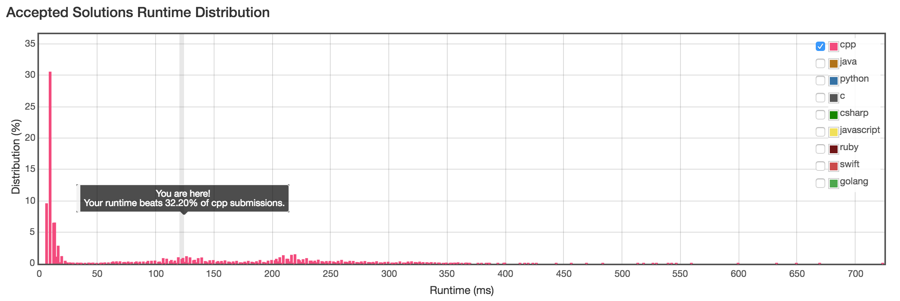

Given an array of integers, return indices of the two numbers such that they add up to a specific target.

You may assume that each input would have exactly one solution, and you may not use the same element twice.

##### Example:
```
Given nums = [2, 7, 11, 15], target = 9,
Because nums[0] + nums[1] = 2 + 7 = 9,
return [0, 1].
```

首先最容易想到的就是遍历。题目中说了，每个输入都有唯一的一个解，那么采用两层遍历，外层 i 从 0 ～ nums.size()-2，内层 j 从 i+1 ~ nums.size()-1。中间若满足target == nums[i] + nums[j]表明已找到，将此时的 i ，j 保存至vector中并退出函数，
由此易知时间复杂度为O(n^2)。然而：



显然还是有很大的优化空间的，毕竟：


唉，还是继续想吧，待更...